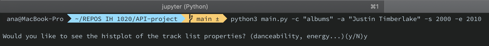

# Pipeline-Project

"The ancient Greeks put one god, Apollo, in charge of both medicine and music. Today's doctors tell us that music can enhance the function of neural networks, slow the heart rate, lower blood pressure, reduce levels of stress hormones and inflammatory cytokines, and provide some relief to patients undergoing surgery, as well as heart attack and stroke victims. But these biological explanations and clinical observations may not do full justice to the effect music has on man and his world. Fortunately, poets and philosophers can fill in the gaps."
[Music and health](https://www.health.harvard.edu/staying-healthy/music-and-health)

In this project I worked with a [Kaggle dataset](https://www.kaggle.com/yamaerenay/spotify-dataset-19212020-160k-tracks?select=data_w_genres.csv) and the [Deezer API](https://developers.deezer.com/login?redirect=/api) so I can navigate trough the most  artists, tracks and albums over the years.

The "data.csv" file contains more than 160.000 songs collected from Spotify Web API, and also you can find data grouped by artist, year, or genre in the data section.
The data is organized this way:

Primary:
- id (Id of track generated by Spotify)
Numerical:
- acousticness (Ranges from 0 to 1)
- danceability (Ranges from 0 to 1)
- energy (Ranges from 0 to 1)
- duration_ms (Integer typically ranging from 200k to 300k)
- instrumentalness (Ranges from 0 to 1)
- valence (Ranges from 0 to 1)
- popularity (Ranges from 0 to 100)
- tempo (Float typically ranging from 50 to 150)
- liveness (Ranges from 0 to 1)
- loudness (Float typically ranging from -60 to 0)
- speechiness (Ranges from 0 to 1)
- year (Ranges from 1921 to 2020)
Dummy:
- mode (0 = Minor, 1 = Major)
- explicit (0 = No explicit content, 1 = Explicit content)
Categorical:
- key (All keys on octave encoded as values ranging from 0 to 11, starting on C as 0, C# as 1 and so on…)
- artists (List of artists mentioned)
- release_date (Date of release mostly in yyyy-mm-dd format, however precision of date may vary)
- name (Name of the song)

This information has been completed with the information obtained from the Deezer API. I've used the [RapidAPI](https://rapidapi.com/deezerdevs/api/Deezer/details) service to make some calls and the API directly to make other ones.

**Cleaning**

This dataset has an usability of 10.0 so I hardly had to work with the data. I worked in the .ipynb file named 'cleaning' mainly with the [Pandas](https://pandas.pydata.org) library to change the column 'duration_ms' from seconds to minutes and replace the "[", ",", "]" from artist column with blank spaces.
This is saved in the clen_data.csv which you can find at the 'output' folder.

**Program**\
Once I had the clean data, I've created some plots for data visualization with [Plotly](https://plotly.com), [Matplotlib](https://matplotlib.org) and [Seaborn](https://seaborn.pydata.org) libraries.

This program has been created to be executed from the terminal with the command "python3 main.py" and one from the next arguments(argparse):

'-a': the artist whom you want obtain the information from. 
'-c': the category from which you want to get the top chart.
'-s': the start year from the range you want to obtaing the songs list by artist.
'-e': the end year from the range you want to obtaing the songs list by artist.

The program let us obtain some plots which you see at the MUSIC.py file of the repo.

Here you are an example of the program execution:

